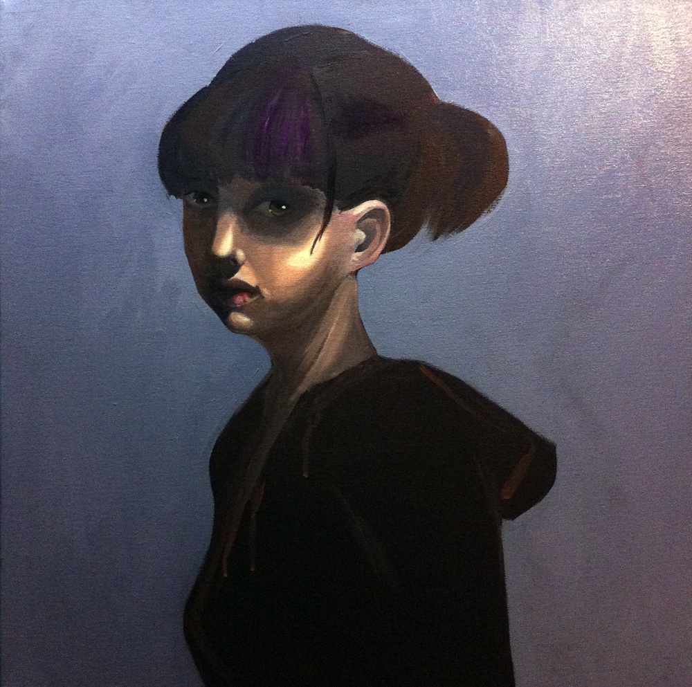

There's a big difference between drawing what you know and drawing what you see. 

We all know what a face looks like. We can draw the symbols that make a face—the eyes, nose, mouth, and ears. We have generic versions of these saved in our memories. We have rules and proportions to guide us—the head is five eyes wide and the eyes have one eye's space between them. In this way, we draw the idea of a face.

Drawing from symbols is easy. It requires minimum attention and little appreciation for detail. 

Drawing from life, from what you see, is difficult. It requires paying more attention to the subject than to what is being made, something the artistic ego often reviles. 

Of course, this isn't just about drawing or painting.

The designer may read many books on typography and may have a long list of grids and formulas. The designer may have a memory full of solutions. But the designer must never forget to observe and to base whatever solutions he finds on the reality that exists around rather than within himself.
